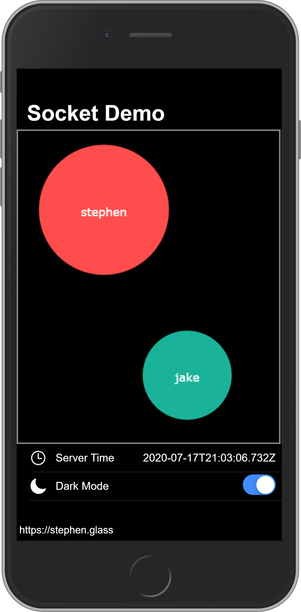

# Ionic React <span>Socket.IO</span> Demo

This project is an example for using Socket.IO with a React client app and an Express server. [Ionic Framework](https://ionicframework.com) is used as a boiler plate for client UI styling.

The user will be asked to create a username when accessing the app. After submitting, a circle will be created on the page with the username and the user will be connected to the server using sockets. The user can drag it's own circle around the canvas of the page. Circles from all clients are synced to the server and to every connected client.



## Client Setup

### Installation

[Download](https://nodejs.org/en/download/) Node.js

```
git clone https://github.com/sglass520/react-socket-demo.git
```

```
npm install -g @ionic/cli
npm install --save
ionic serve
```

### Configuration

`src/constants.ts`

- DEBUG: Enables verbose console logging
- SOCKET_ENDPOINT\*: Set to address and port of socket demo server

(\*) required

### Building

```
ionic build --prod
```

## Server Setup

### Installation

[Download](https://nodejs.org/en/download/) Node.js

```
git clone https://github.com/sglass520/react-socket-demo.git
```

```
cd server
npm install --save
```

### Configuration

`app.js`

- SSL_KEY\*: File location of SSL private key file
- SSL_CERT\*: File location of SSL certificate file
- ORIGINS\*: List of trusted origins to allow socket connections from
- PORT: Port to listen to for incoming socket connections (default: 4001)
- INTERVAL_DATE: Frequency in milliseconds to update clients with server time
- INTERVAL_CLIENTS: Frequency in milliseconds to update clients with synced client info

(\*) required

### Running

```
sudo node app.js
```

#### Running as Forever process

```
npm install -g forever
sudo forever forever.json
```
